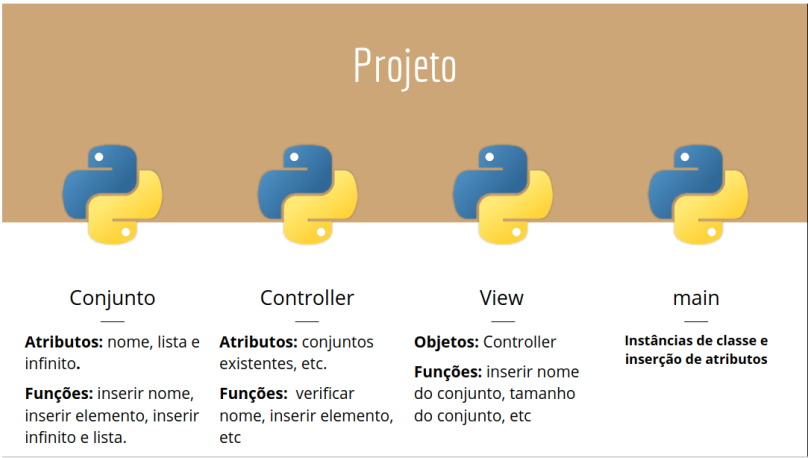

# Arquitetura da aplicação
---

Uma parte importante deste projeto é sua organiza¸ção, dividindo as funcionalidades em classes. 
A classe 'Conjunto' contém as características de um conjunto, como nome e valores respectivos a classe. 
A classe 'Controller' é a responsável por implementar as regras de negócios de um conjunto, ou seja, como inserir os elementos em um conjunto,evitar repetições de valores, etc.
A classe 'View' contem as mensagens  personalizadas e trabalha junto com a classe Controller na visualiza¸cãoo dos resultados. Por último, o aquivo `main.py` contem as instanciações das classes, que apenas recebe os valores (parâmetros) para a classes, gerando um redução significativa de código.
